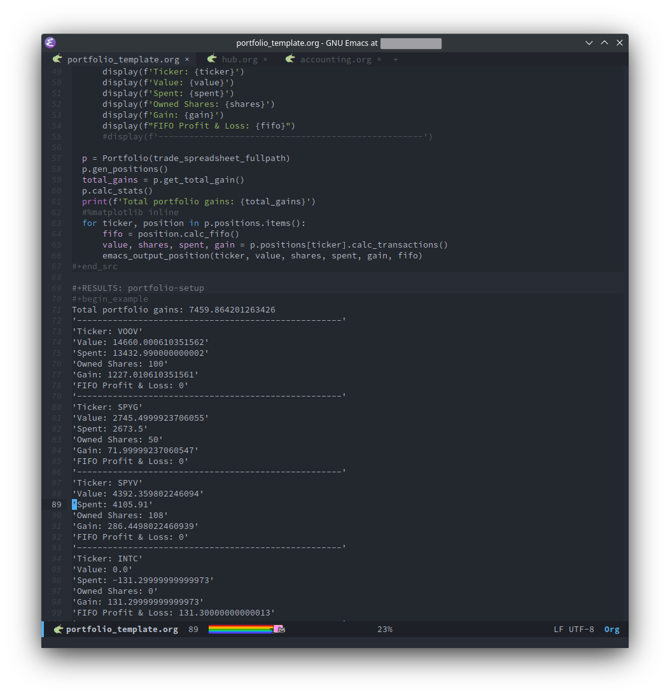
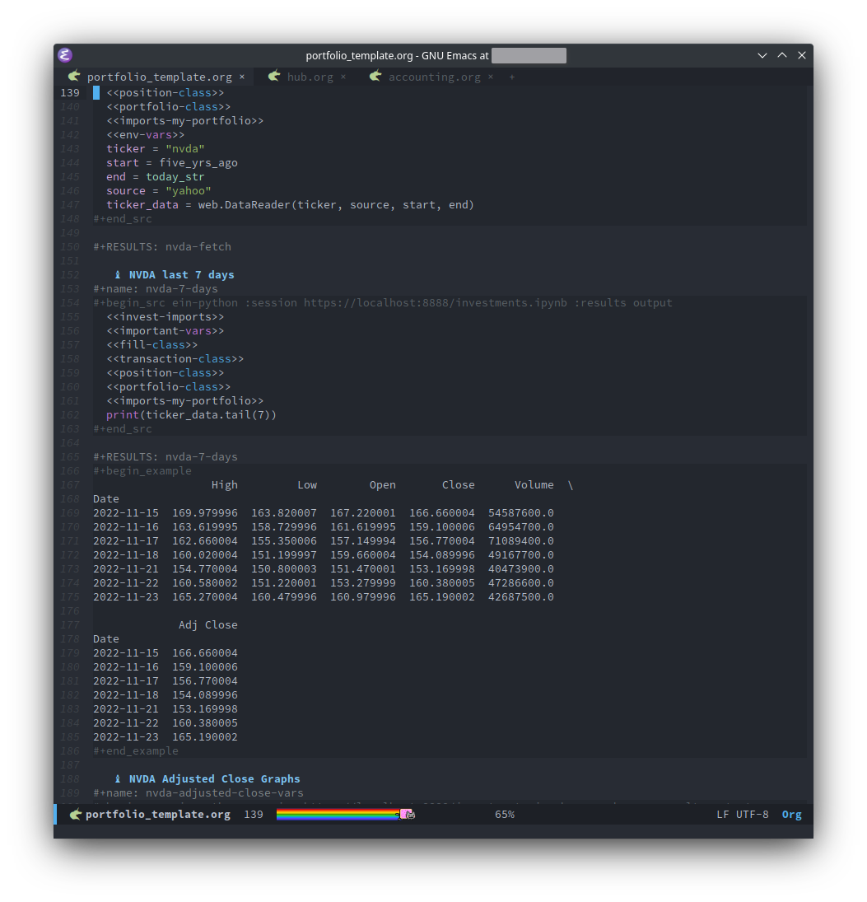
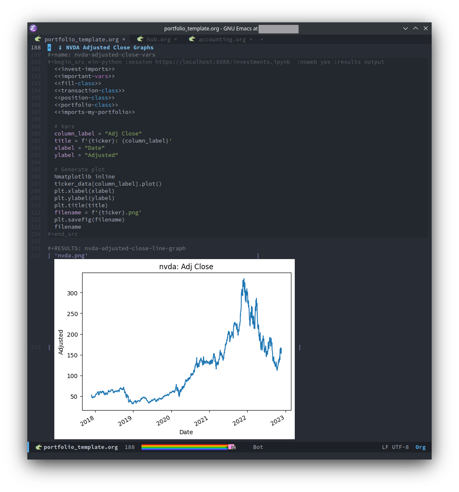
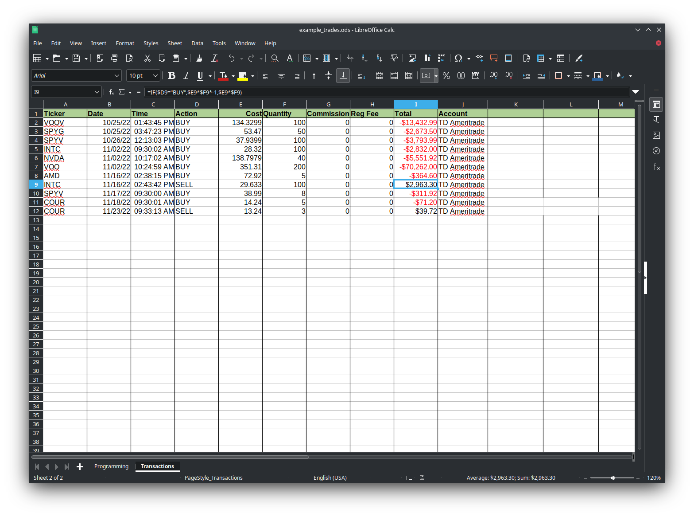

# About
The purpose of this project is to track and analyze my investing portfolio using Emacs Org-mode and Jupyter/IPython Notebooks.

# Emacs setup
All the Emacs settings and packages necessary to run this code can be found in [my emacs dotfiles.](https://github.com/matthewspangler/dotfiles) PIP dependencies are specified in each .org file.

# Current features
- Imports trades from a spreadsheet
- Calculates and displays position information
- FIFO profit calculations
- Fetches and displays market graphs

# Paths I'm exploring
- Portfolio risk analysis
- Track news related to tickers
- Fetch and calculate key metrics for stocks
- Compare portfolio performance to the market
- Automated trading
- Machine learning

# Screenshots

